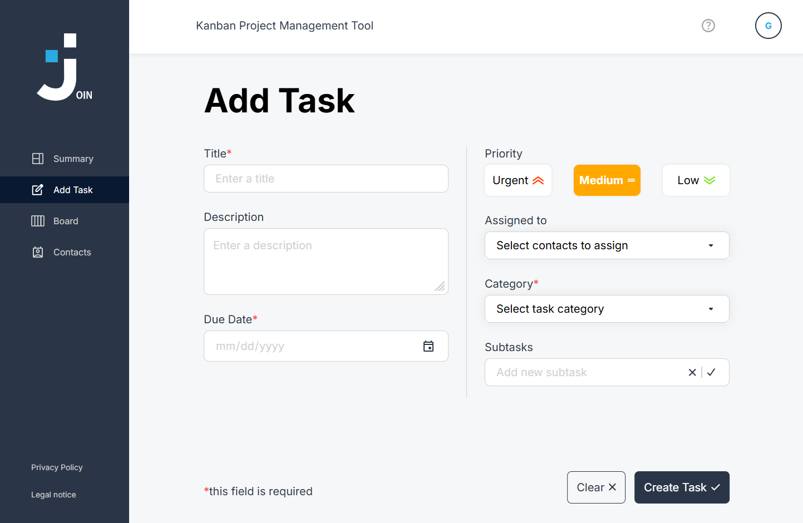
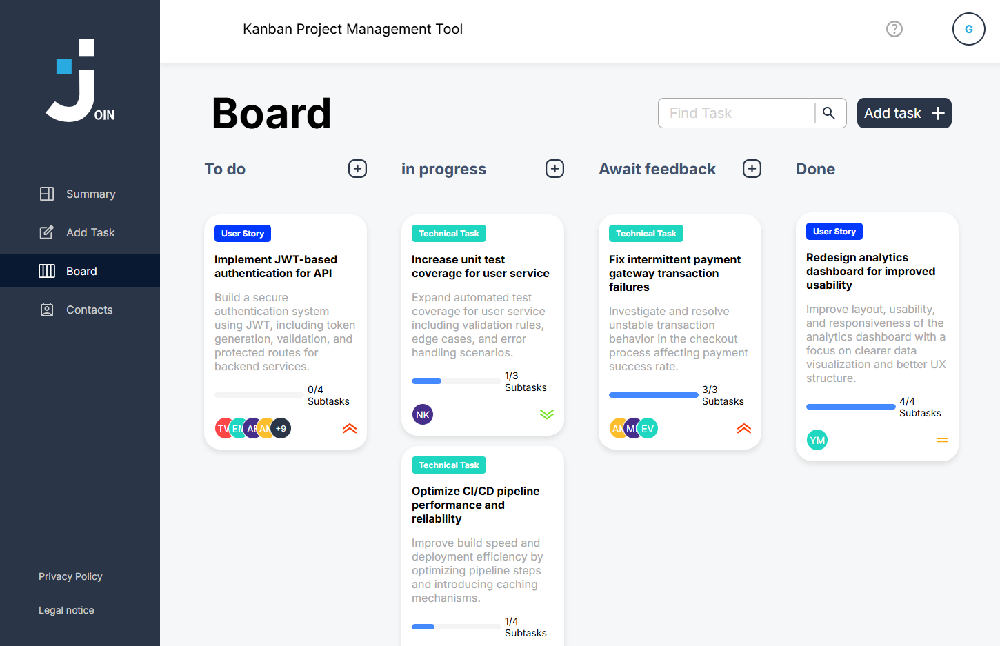

# Join - Kanban Task Management Application with AI Issue Collector

## Reviewer: n8n workflows are here

All reviewable n8n exports are committed in the repository folder [`n8n/`](./n8n/):

| Workflow | Export file | Purpose |
|---|---|---|
| Join - AI Issue Collector | [`n8n/issue-collector.json`](./n8n/issue-collector.json) | Reads stakeholder emails, applies the limit, creates the Firebase ticket and replies |
| Join - Public Issue Collector Status | [`n8n/public-status.json`](./n8n/public-status.json) | Supplies the public `0 of 10` status endpoint |
| Join - External Creator Status Notification | [`n8n/status-notification.json`](./n8n/status-notification.json) | Sends updates when an external ticket changes state |
| Join - Issue Collector Error Handler | [`n8n/error-handler.json`](./n8n/error-handler.json) | Sends the failure notification |

The exports intentionally contain no passwords, tokens or API keys. See
[`n8n/README.md`](./n8n/README.md) for activation and the required end-to-end test.

## Feedback correction — 13 September 2026

The public entry is now `index.html` (Welcome). Member login is available
at `index.html#login`; external requests at `html/stakeholder.html`.
See `FEEDBACK-KORREKTUREN.md` for the completed edits, validation and remaining checks.
The screenshots below show the older group-project version.

## 📖 About the Project

**Join** is a Kanban-style web application for task and workflow management.  
It allows users to create tasks, manage contacts, assign responsibilities, and track progress through subtasks and visual status updates.

This version extends the original group project with a stakeholder-facing email collector. n8n receives emails, enforces a daily limit, asks Gemini for structured triage data and creates clearly labelled tickets in the new **Triage** column.

---

## 📸 Preview




---

## ✨ Key Features

### 📋 Kanban Board

- 5-column Kanban system (Triage, To Do, In Progress, Await Feedback, Done)
- Drag & drop task movement (desktop and mobile support)
- Visual task cards with priority and assignment overview

### 🧩 Task Management

- Create, edit, and delete tasks
- Add subtasks and track completion progress
- Assign contacts to tasks
- Detailed task view with full information

### 👥 Contact Management

- Create and manage contacts
- Assign contacts directly to tasks
- Centralized contact list for better organization

### 🔍 Productivity Features

- Search and filter tasks
- Clear visual workflow and status tracking
- Dashboard-style overview of task distribution
- Email-request counter and AI-generated-ticket labels

### 🤖 AI Issue Collector

- Semantic stakeholder landing page at `html/stakeholder.html`
- Email intake through an importable n8n workflow
- Gemini extraction of title, description, category, priority and deadline
- Strict category/priority allow-lists and model-output validation
- External creator identity displayed in task details
- Daily maximum of 10 processed email requests
- Confirmation, limit, failure and status-update email workflow templates
- No credentials or API keys committed to the repository

### 📱 Responsive Design

- Mobile-first design (320px+ support)
- Optimized for touch and desktop interactions
- Consistent UI across all devices

## 🛠️ Tech Stack

### Frontend

- Vanilla JavaScript (ES6+)
- HTML5
- CSS3

### Backend & Authentication

- Firebase Realtime Database

### Architecture

- Multi-Page Application (MPA)
- Modular code structure

### Development Tools

- Live Server (local development)
- Git & GitHub (version control)
- JSDoc (code documentation)

---

## 📁 Project Structure

```text
join/
├── assets/                # Images, icons, and fonts used across the app
├── html/                  # Main HTML pages for the app
├── scripts/               # JavaScript logic and interactions
│   ├── add-task/          # Task creation and subtask logic
│   ├── board/             # Kanban board logic, drag-and-drop, and task editing
│   ├── contacts/          # Contact management logic and validation
│   └── ...                # Additional script files and helpers
├── styles/                # CSS for layout, components, and responsiveness
│   ├── add-task/          # Styling for the add-task page
│   ├── board/             # Styling for the board page
│   ├── contacts/          # Styling for the contacts page
│   └── ...                # Additional styles and shared CSS files
├── index.html             # Main entry page of the app
├── n8n/                   # Importable automation workflow JSON files
├── .env.example           # Names of required environment settings (no secrets)
├── firebase.rules.example.json # Secure starting point for database rules
├── script.js              # Global app setup and shared logic
├── robots.txt             # Search engine crawler instructions
└── README.md              # Project documentation
```

## 🚀 Installation & Setup

### 1. Clone the repository

```bash
git clone https://github.com/AnnikaEgger/join
cd join
```

### 2. Run the frontend

Serve the repository root through a local web server (for example the VS Code Live Server extension). Opening HTML files directly through `file://` is not supported.

### 3. Configure n8n

1. Import all JSON files from `n8n/`.
2. Create/select IMAP and SMTP credentials inside n8n.
3. Configure the environment values listed in `.env.example`.
4. Create the mailbox folders `erledigt` and `zu bearbeiten`.
5. Add the provider-specific IMAP move operation described in `n8n/README.md`.
6. Select `Join - Issue Collector Error Handler` as the error workflow.
7. Test with one email before activating the workflows.

### 4. Configure the public pages

- Replace `YOUR_REQUEST_EMAIL@example.com` in `html/stakeholder.html`.
- Add the public limit-status endpoint to `scripts/stakeholder.js` when available.
- Add the production status webhook URL to `scripts/config.js`.

Do not place Gemini keys, mail passwords, Firebase tokens or n8n encryption keys in frontend JavaScript or Git.

## Ticket data added by the extension

Email-created tickets use these additional fields:

```json
{
  "column": "triage",
  "source": "email",
  "ai_generated": true,
  "creator": {
    "type": "external",
    "name": "Stakeholder name",
    "email": "stakeholder@example.com"
  },
  "external_message_id": "mail-message-id"
}
```

Manual tickets also start in `triage` and store the signed-in user as an internal creator.

## Security note

The original learning project performs login checks against user records in Firebase and should not be treated as production authentication. Before public deployment, migrate to Firebase Authentication, remove plaintext passwords and apply restrictive database rules. The supplied `firebase.rules.example.json` is a secure starting point, but n8n then needs a trusted backend authentication method.

## Checklist status

- Implemented in code: Triage column/default, internal/external creator metadata, AI labels, stakeholder landing page, daily-limit branch, Gemini schema validation, ticket creation, counters, confirmation/limit/failure/status workflow templates, secret exclusions and documentation.
- Requires account configuration: IMAP/SMTP credentials, Gemini key, Firebase authorization, mailbox folders, public webhook URLs and deployment.
- Provider-specific final step: move successful mail to `erledigt` and failed mail to `zu bearbeiten` using the IMAP operation supported by the chosen mail provider/n8n installation.

## Credits

The original Join application was created as a group project. Preserve the original repository history and contributor credits when publishing this extended version, and document the author of the AI Issue Collector extension separately.
